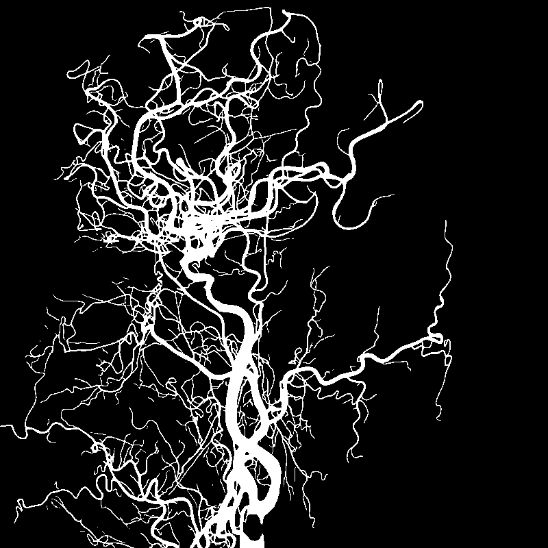
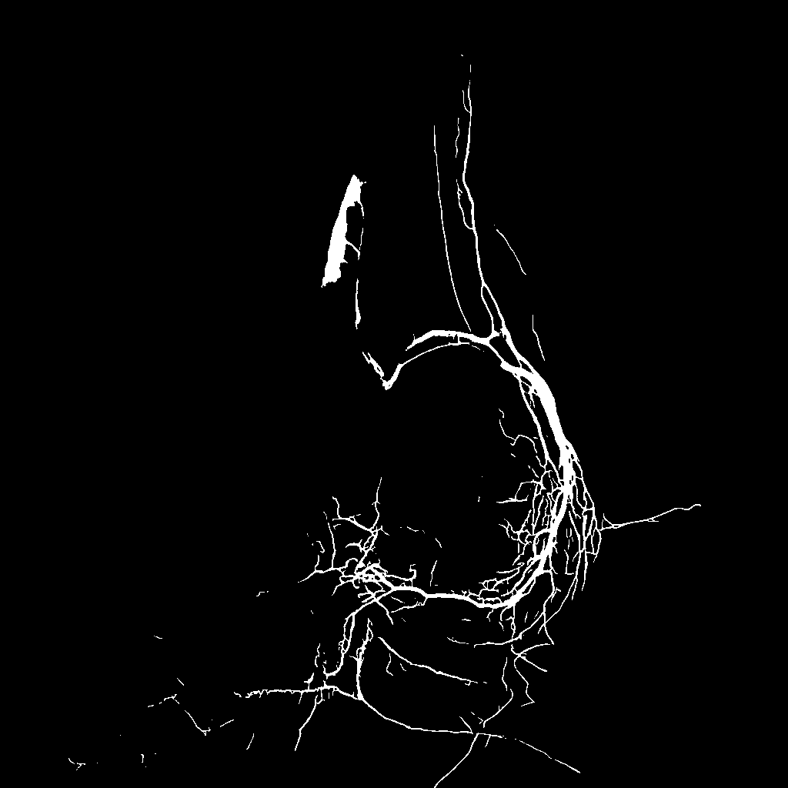
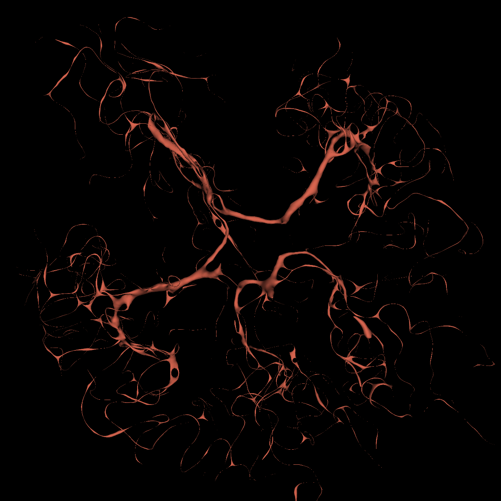

<div align="center">
  <p align="center">
    <h1 align="center">Multi-Modal Angiography Segmentation with nnU-Net</h1>
  </p>

  <p align="center">
    
    &nbsp;
    
    &nbsp;
    
    <br>
    <em>Example vessel segmentations: cerebral DSA, genicular DSA, and MRA.</em>
  </p>
</div>

---

**Multi-Modal Angiography Segmentation** provides a single, lightweight Python interface for running nnU-Net v2 inference across different vascular imaging modalities - from 2D DSA sequences and MIPs to full 3D MRA and CTA volumes. We also provide model weights for these modalities.

- Unified CLI for DSA, MRA, and CTA
- Automatic CUDA / Apple MPS detection
- Plug-and-play custom trainers and loss functions
- png, dicom (only DSA), and nifti (MRA, CTA, DSA) input file formats are currently supported
- You can input a folder for batch inferencing (same format) or single images. No special naming is needed compared to nnUNet's built-in inferencing

---

## Quickstart

Note: The code was tested on macOS and Linux using Python 3.11. Other versions of Python may lead to dependency or compatibility issues.

1. Install PyTorch

```
pip install torch
```

2. Install project requirements

```
pip install -r requirements.txt
```

3. Set your nnUNet_results env variable

```
export nnUNet_results="/path/to/nnUNet_results"
```

4. Run inference (-m allows for modality selection (DSA, MRA, CTA))

```
python run_inference.py -i dicom_data/1_SMG/Post/DSA.dcm -o outputs -m DSA -md nnUNet_results/Dataset113_XFSCAD/nnUNetTrainer_CE_DC_CBDC__nnUNetPlans__2d -f 0
```

## Model Weights

- [Coronary DSA Google Drive](https://drive.google.com/drive/folders/1RkPjdNm0_bmUbHNVJUFkoI8q8nHvxhKo?usp=sharing)
- [Cerebral DSA Google Drive](https://drive.google.com/drive/folders/1KJj5i3SDC9vjTS98Wjnhgk7m7NO5EqpV?usp=sharing)
- [TubeTK MRA Google Drive](https://drive.google.com/drive/folders/1iUmZ3uN2GVuLQYgK_6VsPQ0wQgyXXBlV?usp=sharing)\*
- [CTA Google Drive]()

\*Trained and kindly provided by Alexandre Cafaro, please additionally cite:

```
@InProceedings{Caf_Two_MICCAI2024,
        author={Cafaro, Alexandre and Dorent, Reuben and Haouchine, Nazim and Lepetit, Vincent and Paragios, Nikos and Wells III, William M. and Frisken, Sarah},
        title={Two Projections Suffice for Cerebral Vascular Reconstruction},
        booktitle={proceedings of Medical Image Computing and Computer Assisted Intervention -- MICCAI 2024},
        year={2024},
        publisher={Springer Nature Switzerland},
        volume={LNCS 15007},
        month={October},
        page={722 -- 731}
}
```

## Datasets

The released models were trained on publicly available datasets. If you use the pretrained models, please cite the relevant dataset publications listed below.

| Dataset      | Modality          | License / Access     | Citation                                                                                                                                                     |
| ------------ | ----------------- | -------------------- | ------------------------------------------------------------------------------------------------------------------------------------------------------------ |
| DSCA         | 2D DSA (cerebral) | CC BY 4.0            | [Zhang et al., 2025](https://doi.org/10.5281/zenodo.11255024)                                                                                                |
| FS-CAD       | 2D DSA (coronary) | No license found     | [Zeng et al., 2024](https://www.nature.com/articles/s41598-024-71063-5#data-availability)                                                                    |
| XCAD         | 2D DSA (coronary) | No license found     | [Ma et al., 2021](https://openaccess.thecvf.com/content/ICCV2021/papers/Ma_Self-Supervised_Vessel_Segmentation_via_Adversarial_Learning_ICCV_2021_paper.pdf) |
| IXI\*        | 3D MRA            | CC BY-SA 3.0         | [IXI Dataset](https://brain-development.org/ixi-dataset/)                                                                                                    |
| Lausanne\*   | 3D MRA            | CC0                  | [Di Noto et al., 2022](https://link.springer.com/article/10.1007/s12021-022-09597-0)                                                                         |
| TopCoW2024\* | 3D MRA, 3D CTA    | OpenDataSwiss BY-ASK | [TopCoW Challenge Organizers](https://doi.org/10.5281/zenodo.15692630)                                                                                       |
| TubeTK\*\*   | 3D MRA            | No license found     | [Bullitt et al., 2005](https://data.kitware.com/#collection/591086ee8d777f16d01e0724)                                                                        |

\*Annotated by TopCoW, please additionally cite:

```
@misc{yang2025benchmarkingcowtopcowchallenge,
      title={Benchmarking the CoW with the TopCoW Challenge: Topology-Aware Anatomical Segmentation of the Circle of Willis for CTA and MRA},
      author={Kaiyuan Yang and Fabio Musio and Yihui Ma and Norman Juchler and Johannes C. Paetzold and Rami Al-Maskari and Luciano Höher and Hongwei Bran Li and Ibrahim Ethem Hamamci and Anjany Sekuboyina and Suprosanna Shit and Houjing Huang and Chinmay Prabhakar and Ezequiel de la Rosa and Bastian Wittmann and Diana Waldmannstetter and Florian Kofler and Fernando Navarro and Martin Menten and Ivan Ezhov and Daniel Rueckert and Iris N. Vos and Ynte M. Ruigrok and Birgitta K. Velthuis and Hugo J. Kuijf and Pengcheng Shi and Wei Liu and Ting Ma and Maximilian R. Rokuss and Yannick Kirchhoff and Fabian Isensee and Klaus Maier-Hein and Chengcheng Zhu and Huilin Zhao and Philippe Bijlenga and Julien Hämmerli and Catherine Wurster and Laura Westphal and Jeroen Bisschop and Elisa Colombo and Hakim Baazaoui and Hannah-Lea Handelsmann and Andrew Makmur and James Hallinan and Amrish Soundararajan and Bene Wiestler and Jan S. Kirschke and Roland Wiest and Emmanuel Montagnon and Laurent Letourneau-Guillon and Kwanseok Oh and Dahye Lee and Adam Hilbert and Orhun Utku Aydin and Dimitrios Rallios and Jana Rieger and Satoru Tanioka and Alexander Koch and Dietmar Frey and Abdul Qayyum and Moona Mazher and Steven Niederer and Nico Disch and Julius Holzschuh and Dominic LaBella and Francesco Galati and Daniele Falcetta and Maria A. Zuluaga and Chaolong Lin and Haoran Zhao and Zehan Zhang and Minghui Zhang and Xin You and Hanxiao Zhang and Guang-Zhong Yang and Yun Gu and Sinyoung Ra and Jongyun Hwang and Hyunjin Park and Junqiang Chen and Marek Wodzinski and Henning Müller and Nesrin Mansouri and Florent Autrusseau and Cansu Yalçin and Rachika E. Hamadache and Clara Lisazo and Joaquim Salvi and Adrià Casamitjana and Xavier Lladó and Uma Maria Lal-Trehan Estrada and Valeriia Abramova and Luca Giancardo and Arnau Oliver and Paula Casademunt and Adrian Galdran and Matteo Delucchi and Jialu Liu and Haibin Huang and Yue Cui and Zehang Lin and Yusheng Liu and Shunzhi Zhu and Tatsat R. Patel and Adnan H. Siddiqui and Vincent M. Tutino and Maysam Orouskhani and Huayu Wang and Mahmud Mossa-Basha and Yuki Sato and Sven Hirsch and Susanne Wegener and Bjoern Menze},
      year={2025},
      eprint={2312.17670},
      archivePrefix={arXiv},
      primaryClass={cs.CV},
      url={https://arxiv.org/abs/2312.17670},
}
```

\*\*The MR brain images from healthy volunteers were collected and made available by the CASILab at The University of North Carolina at Chapel Hill and were distributed by the MIDAS Data Server at Kitware, Inc.

## Citation

nnUNetTrainer and loss function implementations are from [cbDice](https://github.com/PengchengShi1220/cbDice) which is licensed under the Apache License 2.0.

If you use this code or the pretrained models in your research, please cite:

```
@inproceedings{shi2024centerline,
title={Centerline Boundary Dice Loss for Vascular Segmentation},
author={Shi, Pengcheng and Hu, Jiesi and Yang, Yanwu and Gao, Zilve and Liu, Wei and Ma, Ting},
booktitle={International Conference on Medical Image Computing and Computer-Assisted Intervention},
pages={46--56},
year={2024},
organization={Springer}
}
```

and

```
BIVS citation placeholder
```
