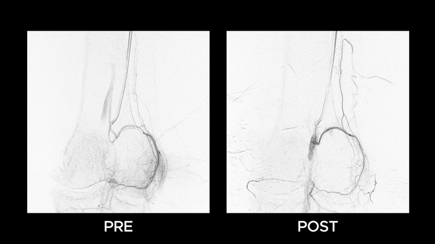

<p align="center">
  <h1 align="center">BIVS - Intraoperative Quantification of Hypervascularity during
Genicular Artery Embolization</h1>
  <p align="center">
    Thomas Wölkhart<sup>1,2,3</sup>
    <a href="https://scholar.google.com/citations?user=Cl3W1LEAAAAJ&hl=en">Sarah Frisken</a><sup>1,2</sup>
    <a href="https://scholar.google.com/citations?user=Cj_wXgsAAAAJ&hl=en">Yan Epelboym</a><sup>1,2</sup>
    <a href="https://scholar.google.com/citations?user=PjpzomsAAAAJ&hl=fr&oi=ao">Nazim Haouchine</a><sup>1,2</sup>
  </p>
  <p align="center">
    <sup>1</sup> Harvard Medical School, &nbsp;
    <sup>2</sup> Brigham and Women's Hospital, &nbsp;
    <sup>3</sup> Technical University of Munich (TUM)
  </p>
</p>

<div align="center">

<a href="https://arxiv.org/abs/placeholder"></a>
<a href="https://github.com/AISIGSJTU/SSVS"></a>
<a href="https://github.com/newfyu/DeepSA"></a>
<a href="#license"></a>

</div>

<div align="center">

<p align="center">
    
    <br>
    <em>BIVS enables standardized, quantitative assessment of vascular changes during GAE based on vessel segmentation, in-painting and thresholding.</em>
</p>

</div>

## Abstract

Genicular Artery Embolization (GAE) is a minimally invasive treatment for osteoarthritis-related knee pain, but intraoperative evaluation remains qualitative and lacks standardized metrics. We present Blush Isolation via Vessel Subtraction (BIVS), a computer vision method for quantifying the extent of embolization (EoE) from digital subtraction angiography (DSA) images. **BIVS segments large vessels with an nnU-Net trained on coronary angiograms using topology-preserving loss functions, then inpaints these vessels to isolate residual blush.** From the resulting blush maps, EoE is defined as the relative reduction in blush between pre- and post-embolization images, measured in terms of either area or intensity. Despite limited availability of annotated genicular datasets, the vessel masks were sufficient for robust blush isolation. The EoE metric showed reproducibility and potential for intraoperative use. This framework enables standardized, quantitative assessment of vascular changes during GAE and can be further validated against radiologist scoring, MRI, and clinical outcomes.

<p align="center">
   
</p>
<p align="center">
  <em>Overview of our BIVS framework</em>
</p>

## Quickstart

Note: This repository contains the code for the segmentation step of the pipeline. The code was tested on macOS and Linux using Python 3.11. Other versions of Python may lead to dependency or compatibility issues.

1. Install PyTorch

```
pip install torch
```

2. Install project requirements

```
pip install -r requirements.txt
```

3. Run inference (DICOM or PNG input)

```
python run_inference.py \
  -i dicom_data/1_SMG/Post/DSA.dcm \
  -o outputs \
  -m nnUNet_results/Dataset113_XFSCAD/nnUNetTrainer_CE_DC_CBDC__nnUNetPlans__2d \
  -f 0
```

- The script automatically uses CUDA or Apple MPS if available.
- nnUNetTrainer and loss function implementations are from [cbDice Paper Implementation](https://github.com/PengchengShi1220/cbDice)
- Model weights can be found on [Google Drive](https://drive.google.com/drive/folders/1ZlnhJurHPzOPndgY1RdaRFrTJHGgjoYY?usp=sharing)

## Citation

If you use BIVS in your research, please cite:

```
citation placeholder
```
